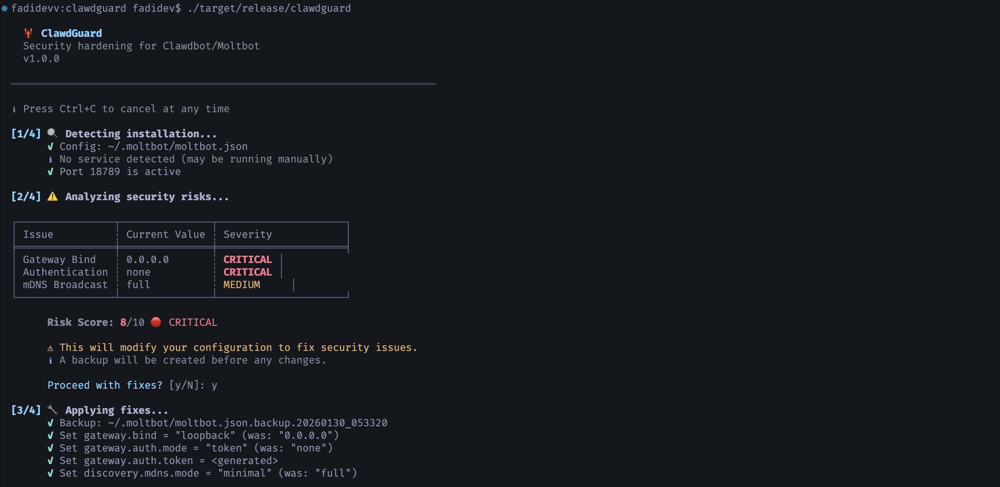

# 🦞 ClawdGuard

[](https://crates.io/crates/clawdguard)
[](https://crates.io/crates/clawdguard)
[](https://github.com/fadidevv/clawdguard/stargazers)
[](https://github.com/fadidevv/clawdguard/network)
[](https://github.com/fadidevv/clawdguard/issues)
[](https://opensource.org/licenses/MIT)

Security hardening for Clawdbot/Moltbot installations. Detects and fixes exposed gateways.

<p align="center">
  
</p>

<p align="center">
  <strong>Detect and fix exposed Clawdbot/Moltbot gateways</strong>
</p>

<p align="center">
  <a href="#the-problem">Problem</a> •
  <a href="#features">Features</a> •
  <a href="#quick-start">Quick Start</a> •
  <a href="#docker-setup">Docker</a> •
  <a href="#cli-reference">CLI</a> •
  <a href="#what-gets-fixed">What Gets Fixed</a> •
  <a href="#development">Development</a>
</p>

---

## The Problem

**900+ Clawdbot/Moltbot instances are currently exposed on the internet** (visible on Shodan, port 18789) without any authentication. This allows anyone to:

| Risk | Impact |
|------|--------|
| Access API keys | Steal OpenAI, Anthropic, and other credentials |
| Execute commands | Run arbitrary shell commands on your machine |
| Control browser | Take over your browsing session |
| Read emails | Access Gmail, calendar, contacts |
| Read chats | See all your conversation history |
| Hijack the bot | Send messages on your behalf |

The issue isn't a bug—it's **misconfiguration**. Users who change `gateway.bind` to `0.0.0.0` or use Docker with `-p 18789:18789` without proper auth are fully exposed.

ClawdGuard fixes this.

---

## Features

- **Auto-Detect** - Finds config, service, and running gateway automatically
- **Risk Analysis** - Scores your configuration 0-10 with detailed breakdown
- **One-Click Fix** - Patches config, generates secure token, restarts service
- **Verification** - Confirms the fix worked (port closed, auth required)
- **Safe** - Creates timestamped backup before any changes
- **Cross-Platform** - macOS (launchd) and Linux (systemd)
- **Graceful Stop** - Press Ctrl+C anytime to cancel safely
- **Verbose Mode** - See detailed logs of every check being performed
- **Docker Ready** - No Rust installation required

---

## Quick Start

### 1. Choose Your Installation

#### Option A: Install from crates.io (Recommended)

```bash
cargo install clawdguard

# Run
clawdguard
```

#### Option B: Build from Source

```bash
# Clone repository
git clone https://github.com/fadidevv/clawdguard.git
cd clawdguard

# Build (first time takes ~2 min)
cargo build --release

# Run
./target/release/clawdguard
```

#### Option C: With Docker (No Rust Required)

```bash
# Clone repository
git clone https://github.com/fadidevv/clawdguard.git
cd clawdguard

# Build image (~3-5 min first time)
docker build --no-cache -t clawdguard .

# Run (mount your config directory)
docker run -v ~/.moltbot:/root/.moltbot clawdguard
# Or for legacy Clawdbot:
docker run -v ~/.clawdbot:/root/.clawdbot clawdguard
```

### 2. Run

```bash
clawdguard
```

That's it! ClawdGuard will:

1. Detect your Clawdbot/Moltbot installation
2. Analyze security risks in your configuration
3. Ask for confirmation before making changes
4. Patch the config with secure settings
5. Verify the fixes were successful

### 3. Save Your Token

ClawdGuard generates a secure token. **Save it!**

```
╭────────────────────────────────────────────────────────────────────╮
│  ⚠️  IMPORTANT: Save your new gateway token!                       │
│                                                                    │
│    clwd_a8f2k9x3m1p7v4q2b6n8...                                    │
│                                                                    │
│  You'll need this to connect from the Control UI or CLI.          │
╰────────────────────────────────────────────────────────────────────╯
```

---

## Docker Setup

Full Docker documentation for those without Rust installed.

### Build & Run

```bash
# 1. Clone repository
git clone https://github.com/fadidevv/clawdguard.git
cd clawdguard

# 2. Build image (~3-5 min first time)
docker build --no-cache -t clawdguard .

# 3. Run scan (mount your config directory)
# For Moltbot (newer):
docker run -v ~/.moltbot:/root/.moltbot clawdguard

# For Clawdbot (legacy):
docker run -v ~/.clawdbot:/root/.clawdbot clawdguard

# With verbose mode
docker run -v ~/.moltbot:/root/.moltbot clawdguard --verbose

# Scan only (no fixes)
docker run -v ~/.moltbot:/root/.moltbot clawdguard --scan-only

# Auto mode (no prompts)
docker run -v ~/.moltbot:/root/.moltbot clawdguard --auto

# Show help
docker run clawdguard --help
```

### Docker Compose

Simpler syntax using docker-compose:

```bash
# Run with docker-compose
docker-compose run clawdguard

# With verbose
docker-compose run clawdguard --verbose

# Scan only
docker-compose run clawdguard --scan-only

# Auto mode
docker-compose run clawdguard --auto
```

### Docker Commands Reference

| Command | Description |
|---------|-------------|
| `docker build --no-cache -t clawdguard .` | Build image |
| `docker run clawdguard --help` | Show help |
| `docker run -v ... clawdguard` | Run scan |
| `docker run -v ... clawdguard --scan-only` | Scan only |
| `docker run -v ... clawdguard --auto` | Auto fix |
| `docker run -v ... clawdguard --verbose` | Verbose mode |
| `docker-compose run clawdguard` | Run with compose |

### Volume Mounts

| Mount | Purpose |
|-------|---------|
| `~/.moltbot:/root/.moltbot` | Your Moltbot config directory (newer) |
| `~/.clawdbot:/root/.clawdbot` | Your Clawdbot config directory (legacy) |
| `./results:/app/results` | Save results locally |

### Docker Tips

```bash
# Create alias for easier usage (use your config directory)
alias clawdguard='docker run -v ~/.moltbot:/root/.moltbot clawdguard'
# Or for legacy Clawdbot:
alias clawdguard='docker run -v ~/.clawdbot:/root/.clawdbot clawdguard'

# Then just run:
clawdguard
clawdguard --scan-only
clawdguard --verbose
```

---

## CLI Reference

```
clawdguard [OPTIONS]

OPTIONS:
    --scan-only         Only scan for issues, don't apply fixes
    --auto              Apply all fixes without confirmation prompts
    --backup-dir <DIR>  Custom directory for backup files
    --skip-firewall     Skip adding firewall rules
    --skip-restart      Skip restarting the gateway service
    --token <TOKEN>     Use a specific token instead of generating one
    -v, --verbose       Show detailed output
    --json              Output results as JSON (for scripting)
    -h, --help          Print help
    -V, --version       Print version
```

### Examples

```bash
# Basic usage - scan, fix, verify
clawdguard

# Scan only (don't fix anything)
clawdguard --scan-only

# Fix everything automatically (no prompts)
clawdguard --auto

# Use your own token
clawdguard --token "my-secure-token-here"

# Verbose output for troubleshooting
clawdguard --verbose

# JSON output for scripting
clawdguard --json

# Combine options
clawdguard --auto --skip-firewall --verbose

# Custom backup directory
clawdguard --backup-dir /tmp/backups
```

---

## What Gets Fixed

| Setting | Before (Insecure) | After (Secure) |
|---------|-------------------|----------------|
| `gateway.bind` | `"0.0.0.0"` / `"lan"` / `"all"` | `"loopback"` |
| `gateway.auth.mode` | `"none"` / missing | `"token"` |
| `gateway.auth.token` | missing | Generated secure token |
| `discovery.mdns.mode` | `"full"` | `"minimal"` |
| File permissions | `644` / `755` | `600` |

### Risk Score

ClawdGuard calculates a risk score from 0-10:

| Score | Level | Meaning |
|-------|-------|---------|
| 0-3 | 🟢 LOW | Minor issues or already secure |
| 4-6 | 🟡 MEDIUM | Some security concerns |
| 7-10 | 🔴 CRITICAL | Exposed to internet, fix immediately |

**Risk Score Calculation:**
- Exposed bind address: +3 points
- Missing authentication: +4 points
- External port reachable: +2 points
- mDNS information leak: +1 point
- Open file permissions: +1 point

---

## Output Examples

### Normal Mode

```
  🦞 ClawdGuard
  Security hardening for Clawdbot/Moltbot
  v1.0.0

━━━━━━━━━━━━━━━━━━━━━━━━━━━━━━━━━━━━━━━━━━━━━━━━━━━━━━━━━━━━━━━━━━━━━━

ℹ Press Ctrl+C to cancel at any time

[1/4] 🔍 Detecting installation...
      ✓ Config: ~/.clawdbot/clawdbot.json
      ✓ Service: bot.molt.gateway (running, PID 1234)
      ✓ Port 18789 is active

[2/4] ⚠️  Analyzing security risks...

╭──────────────────┬─────────────────────────┬──────────╮
│ Issue            │ Current Value           │ Severity │
├──────────────────┼─────────────────────────┼──────────┤
│ Gateway Bind     │ 0.0.0.0                 │ CRITICAL │
│ Authentication   │ none                    │ CRITICAL │
│ mDNS Broadcast   │ full                    │ MEDIUM   │
╰──────────────────┴─────────────────────────┴──────────╯

      Risk Score: 9/10 🔴 CRITICAL

      ⚠ This will modify your configuration to fix security issues.
      ℹ A backup will be created before any changes.

      Proceed with fixes? [y/N]: y

[3/4] 🔧 Applying fixes...
      ✓ Backup: ~/.clawdbot/clawdbot.json.backup.20260128_143022
      ✓ Set gateway.bind = "loopback" (was: "0.0.0.0")
      ✓ Set gateway.auth.mode = "token" (was: "none")
      ✓ Set gateway.auth.token = <generated>
      ✓ Fixed file permissions (600)

      Generated Token: clwd_a8f2k9x3m1p7v4q2b6n8...

[4/4] ✅ Verifying fixes...
      ✓ Gateway service restarted
      ✓ Port 18789 no longer reachable externally
      ✓ Gateway responding on localhost
      ✓ Authentication is now required

━━━━━━━━━━━━━━━━━━━━━━━━━━━━━━━━━━━━━━━━━━━━━━━━━━━━━━━━━━━━━━━━━━━━━━

╭────────────────────────────────────────────────────────────────────╮
│                                                                    │
│  🎉 SUCCESS! Your Clawdbot/Moltbot is now secure.                  │
│                                                                    │
╰────────────────────────────────────────────────────────────────────╯
```

### JSON Output

```bash
clawdguard --json
```

```json
{"status": "fixed", "token": "clwd_a8f2k9x3m1p7v4q2b6n8...", "backup": "~/.clawdbot/clawdbot.json.backup.20260128_143022"}
```

---

## Graceful Stop (Ctrl+C)

Press `Ctrl+C` anytime during scanning to stop safely.

```
[2/4] ⚠️  Analyzing security risks...
^C
⚠ Interrupted! Exiting...
```

No changes are made until you confirm, so interrupting is always safe.

---

## After Running

### Update Your Environment

```bash
# Add to your shell profile (~/.bashrc, ~/.zshrc, etc.)
export CLAWDBOT_GATEWAY_TOKEN="clwd_your_token_here"
```

### Remote Access (Secure Methods)

If you need remote access, use one of these **secure** methods:

| Method | Command |
|--------|---------|
| **Tailscale** (Recommended) | `tailscale serve --bg 18789` |
| **SSH Tunnel** | `ssh -L 18789:localhost:18789 your-server` |
| **Cloudflare Tunnel** | `cloudflared tunnel --url http://localhost:18789` |

**Never** change `gateway.bind` back to `0.0.0.0` or expose the port directly.

---

## Troubleshooting

### "No Clawdbot/Moltbot installation found"

Make sure:
- Clawdbot or Moltbot is installed
- You've run it at least once (creates `~/.moltbot/` or `~/.clawdbot/`)
- Config file exists at `~/.moltbot/moltbot.json` or `~/.clawdbot/clawdbot.json`

### "Could not restart service"

Try manually:
```bash
clawdbot gateway restart
# or
moltbot gateway restart
```

### Token Not Working

1. Save the complete token (including `clwd_` prefix)
2. Add to environment or Control UI settings
3. Restart the gateway

### Docker: Permission Denied

Make sure your config directory is readable:
```bash
# For Moltbot (newer)
chmod 755 ~/.moltbot
chmod 644 ~/.moltbot/moltbot.json

# For Clawdbot (legacy)
chmod 755 ~/.clawdbot
chmod 644 ~/.clawdbot/clawdbot.json
```

---

## Platform Support

| Platform | Status | Service Manager |
|----------|--------|-----------------|
| macOS | ✅ Full | launchd |
| Linux | ✅ Full | systemd (user) |
| Windows | ⚠️ WSL2 | Run inside WSL2 |

---

## How It Works

```
┌─────────────────────────────────────────────────────────────────┐
│                        ClawdGuard v1.0                          │
├─────────────────────────────────────────────────────────────────┤
│                                                                 │
│  ┌──────────┐   ┌──────────┐   ┌──────────┐   ┌──────────┐     │
│  │ DETECT   │ → │ ANALYZE  │ → │  PATCH   │ → │ VERIFY   │     │
│  └──────────┘   └──────────┘   └──────────┘   └──────────┘     │
│       │              │              │              │            │
│       ▼              ▼              ▼              ▼            │
│  Find config    Check risks    Fix config    Confirm safe      │
│  Find service   Score danger   Gen token     Test port         │
│  Find process   List issues    Fix perms     Restart svc       │
│                                                                 │
└─────────────────────────────────────────────────────────────────┘
```

---

## Project Structure

```
clawdguard/
├── Cargo.toml           # Dependencies
├── Dockerfile           # Docker build
├── docker-compose.yml   # Docker compose
├── .dockerignore
├── README.md
├── LICENSE
├── .gitignore
├── assets/
│   └── screenshot.png   # Screenshot for README
├── src/
│   ├── main.rs          # CLI entry point
│   ├── lib.rs           # Library root
│   ├── detect/          # Installation detection
│   │   ├── mod.rs
│   │   ├── config.rs    # Config file detection
│   │   ├── process.rs   # Process detection
│   │   └── service.rs   # Service detection (launchd/systemd)
│   ├── analyze/         # Security analysis
│   │   ├── mod.rs
│   │   ├── config_risk.rs
│   │   ├── network.rs   # Port exposure check
│   │   └── permissions.rs
│   ├── patch/           # Configuration patching
│   │   ├── mod.rs
│   │   ├── config.rs
│   │   ├── firewall.rs
│   │   └── token.rs     # Secure token generation
│   ├── verify/          # Fix verification
│   │   ├── mod.rs
│   │   ├── port_check.rs
│   │   └── service.rs
│   └── output/
│       ├── mod.rs
│       └── printer.rs   # Colorful CLI output
└── tests/
    └── integration.rs
```

---

## Development

### Prerequisites

**Option A: Native (Rust)**
- Rust 1.70+ (`curl --proto '=https' --tlsv1.2 -sSf https://sh.rustup.rs | sh`)

**Option B: Docker**
- Docker 20.10+

### Building

**Native:**
```bash
# Clone repository
git clone https://github.com/fadidevv/clawdguard.git
cd clawdguard

# Build debug (faster compile)
cargo build

# Build release (optimized)
cargo build --release
```

**Docker:**
```bash
# Clone repository
git clone https://github.com/fadidevv/clawdguard.git
cd clawdguard

# Build image
docker build --no-cache -t clawdguard .
```

### Running Tests

```bash
# Run all tests
cargo test

# Run with output
cargo test -- --nocapture
```

### Code Quality

```bash
# Format code
cargo fmt

# Run linter
cargo clippy

# Check without building
cargo check
```

---

## Contributing

Contributions welcome! Please:

1. Fork the repository
2. Create a feature branch (`git checkout -b feature/improvement`)
3. Make your changes
4. Run tests (`cargo test`)
5. Run linter (`cargo clippy`)
6. Format code (`cargo fmt`)
7. Commit changes (`git commit -m 'Add improvement'`)
8. Push to branch (`git push origin feature/improvement`)
9. Open a Pull Request

**Ideas for contributions:**
- Add support for more service managers
- Improve detection heuristics
- Add rollback functionality
- Documentation improvements
- Bug fixes

---

## Disclaimer

This tool is for **security purposes only**.

- Only run on systems you own or have permission to modify
- Always verify the token was saved before closing the terminal
- Test the fix by attempting to connect from another device

**The authors are not responsible for misuse of this tool.**

---

## License

MIT License - see [LICENSE](LICENSE) for details.

---

<p align="center">
  <strong>Stay secure! 🦞🔐</strong>
</p>

